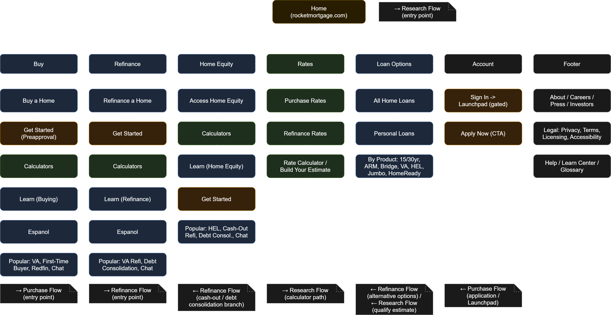
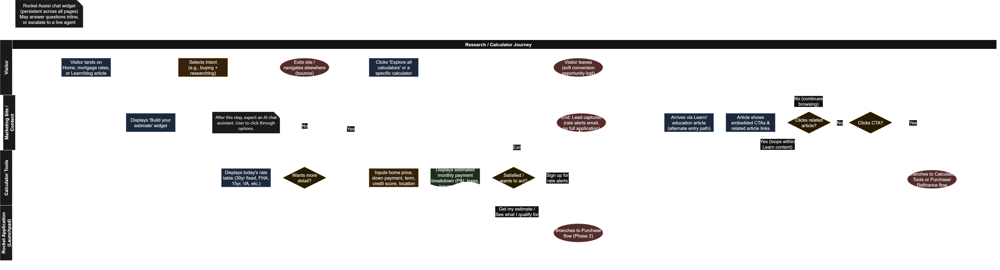

# Rocket Mortgage – Site Map & User Flow Diagrams

This project maps rocketmortgage.com's site architecture and key user journeys as a visual portfolio piece. Each diagram links to a full-size, zoomable version — click any image to open it.

> Portfolio/demo project — not affiliated with or endorsed by Rocket Mortgage. Site structure captured from the live public site.

## Diagrams

### Site Map

*Detailed spec: [01_Sitemap.md](01_Sitemap.md)*

### Purchase Flow

*Detailed spec: [02_User_Flow_Purchase.md](02_User_Flow_Purchase.md)*

### Refinance Flow

*Detailed spec: [03_User_Flow_Refinance.md](03_User_Flow_Refinance.md)*

### Research / Calculator Flow

*Detailed spec: [04_User_Flow_Research.md](04_User_Flow_Research.md)*
